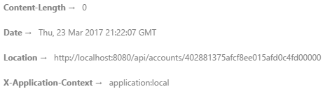

# Coding Cookbook

## Milestone 2: Adapt the skeleton code

1. In the next section, we'll try to do a GET and POST on our newly created Account resource. Make sure the service returns dummy values.  You can use below information to complete your initial controller implementation:
   1. Usefull info
      1. A method on an operation: [javadoc](http://docs.spring.io/spring/docs/current/javadoc-api/org/springframework/web/bind/annotation/RequestMapping.html#method--)
      2. ResponseEntity: [javadoc](http://docs.spring.io/spring/docs/current/javadoc-api/org/springframework/http/ResponseEntity.html)
      3. Building a ResponseEntity: [tutorial](http://spring.io/guides/tutorials/bookmarks/#_building_a_rest_service)
   2. GET returns a ResponseEntity class with a valid statuscode
   3. POST returns a ResponseEntity with a valid statuscode
      1. User should also receive the address location 
      
      

      2. Use a JSON body when testing your operation
      3. Body:
```json
{
	"label" : "mytest",
	"type" : "checkings",
	"owners" : [ "1" ],
	"iban" : "myiban"
}
```

   4. More info can be found here: [tutorial](http://spring.io/guides/tutorials/bookmarks/#_building_a_rest_service)
---
2. **What status code will be returned on the GET and POST operation?**
