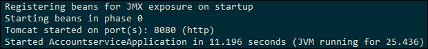
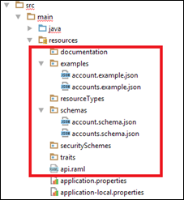
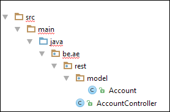

# Coding Cookbook
## Milestone 1: from design to code

1. Generate your own project by going to: [http://start.spring.io/](http://start.spring.io/)
   1. Generate a **maven** project with spring boot **1.5.2** (no snapshots)
   2. Group: ```be.ae```
   3. Artifact: ```accountservice```
   4. Manually enter all the following dependencies: ```Actuator``` ```Cloud connectors``` ```AOP``` ```Web```
   5. Generate project

2. Setup in IDE
   1. Extract the zip
   2. Import your project in Intellij (using the import feature)
      1. You can select the pom.xml file
      2. Make sure the Java JDK (**1.8**) is configured on your IDE

3. Configure the 'pom.xml' with following dependencies as we'll need these later:

```xml
<!-- RAML -->
<dependency>
    <groupId>com.phoenixnap.oss</groupId>
    <artifactId>springmvc-raml-plugin</artifactId>
    <version>0.10.2</version>
</dependency>

<!-- Utils -->
<dependency>
   <groupId>org.projectlombok</groupId>
   <artifactId>lombok</artifactId>
   <version>1.16.6</version>
</dependency>
<dependency>
   <groupId>net.sf.dozer</groupId>
   <artifactId>dozer</artifactId>
   <version>5.5.1</version>
</dependency>
```

4. Test your project by running:
```
mvn spring-boot:run
```

5. **Question:**
   1. **What does the above command do?**
   2. **Which application server is by default used when executing above command?**

6. If everything went well you should see:



7. Put all your RAML files in following package:



8. Add following plugin to your build step of your pom.xml file:

```xml
<plugin>
	<groupId>com.phoenixnap.oss</groupId>
	<artifactId>springmvc-raml-plugin</artifactId>
	<version>0.10.2</version>
	<configuration>
		<ramlPath>src/main/resources/api.raml</ramlPath>
		<schemaLocation>src/main/resources/schema/</schemaLocation>
		<outputRelativePath>/target/generated-classes</outputRelativePath>
		<addTimestampFolder>false</addTimestampFolder>
		<basePackage>be.ae.rest</basePackage>
		<baseUri>/api</baseUri>
		<generateUnreferencedSchemas>true</generateUnreferencedSchemas>
		<generationConfig>
			<includeAdditionalProperties>false</includeAdditionalProperties>
		</generationConfig>
		<seperateMethodsByContentType>false</seperateMethodsByContentType>
		<rule>com.phoenixnap.oss.ramlapisync.generation.rules.Spring4ControllerStubRule</rule>
		<ruleConfiguration>
		</ruleConfiguration>
	</configuration>
	<executions>
		<execution>
			<id>generate-springmvc-endpoints</id>
			<phase>compile</phase>
			<goals>
				<goal>generate-springmvc-endpoints</goal>
			</goals>
		</execution>
	</executions>
</plugin>
```

8. **Questions:**
   1. **What will this code do?**
   2. **When will this code run?**

10. Configure it so that:
   1. Your schema on a previously specified location is used to generate the code
   2. The generated classes are exported to: &#39;target/generated-classes&#39;
11. Build your code (not the same command as we used to launch the spring application)
12. Check if the java files are correctly generated
13. Copy the previously generated code in the src/main/java package


