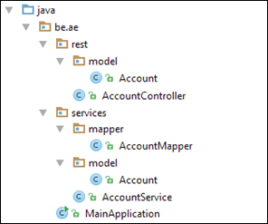

# Coding Cookbook
## Milestone 3

1. Create a layered architecture within your webservice:
   1. Themes to keep into account: CDI, service façade, layering
   2. Info: Within our architecture we can define 2 layers
      1. The representation layer: **AccountController**
         This also contains all the representation models
      2. The service layer: **AccountService**
         In this layer we can implement our business logic
   3. Create the different service and repository objects in the correct packages to obtain a layered structure

   4. Adapt the AccountController so that you can reference the AccountService in the controller. (Hint: Use CDI via direct field injection)
   5. For each method in the AccountController create a matching method in the AccountService

2. Monitoring and sanity checks
   1. We use Spring Boot with Actuator: [tutorial](http://docs.spring.io/spring-boot/docs/1.2.5.RELEASE/reference/htmlsingle/#production-ready)
   2. Check the health page of your project
